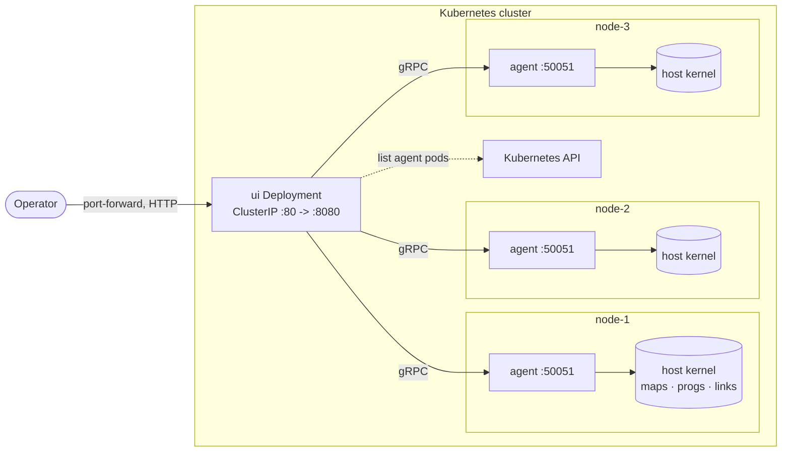

# bpf-explorer

A cluster-wide, read-only web UI for browsing eBPF maps and programs across
Kubernetes nodes - so you don't have to `kubectl exec` into a per-node
[`bpftool-daemon`](https://github.com/lazybpf/bpftool-daemon) pod to see what's
loaded.

> [!NOTE]
> This is a relatively new project, so there may be some hiccups. If you hit
> one, please [open an issue](https://github.com/lazybpf/bpf-explorer/issues)
> with the build version from the UI header - or `bpf-explorer --version` - e.g.
> `v0.1.0 (0dd5b51)`, plus the output of `kubectl get nodes -o wide`. Kernel
> version, OS image, and container runtime largely decide which BPF objects are
> inspectable at all.

It runs as two components:

- agent (`--role=agent`) - gRPC server in a privileged DaemonSet; reads maps and
  programs via `cilium/ebpf`.
- ui (`--role=ui`) - a Deployment that discovers agents via the Kubernetes API
  and fans out gRPC calls, serving HTML. `ClusterIP` only; reached via
  `kubectl port-forward`.

One binary serves both roles; one image runs both workloads. A third role,
`--role=local`, runs the two together in a single process for development
without a cluster - see [Run locally without a cluster](#run-locally-without-a-cluster).

In a three-node cluster with an agent on every node:



Images are published to GHCR for `linux/amd64` and `linux/arm64`.

## Quick start

Nothing to clone - label the node(s) you want an agent on and apply the manifest
attached to the latest release:

```console
kubectl label node <node> bpf-explorer=true
```

```console
kubectl apply -f https://github.com/lazybpf/bpf-explorer/releases/latest/download/bpf-explorer.yaml
```

Then port-forward the UI and browse http://localhost:8080:

```console
kubectl -n bpf-explorer port-forward svc/bpf-explorer-ui 8080:80
```

Or run it in the background so it does not block your terminal:

```console
nohup kubectl -n bpf-explorer port-forward svc/bpf-explorer-ui 8080:80 > /tmp/bpf-explorer-pf.log 2>&1 &
```

> [!TIP]
> The DaemonSet uses a `nodeSelector` (`bpf-explorer: "true"`) so agents only
> land on labelled nodes. Remove the selector to run on every node.

## Trace log

Each node has a `tracelog` tab that tails tracefs `trace_pipe` - the same source
as `bpftool prog tracelog`, where `bpf_trace_printk()` output lands. Lines stream
to the browser over
[server-sent events](https://developer.mozilla.org/en-US/docs/Web/API/Server-sent_events),
newest line first, with pause, clear, a substring filter, arrival timestamps and
a wrap toggle.

> [!WARNING]
> Reading `trace_pipe` drains the node's single global trace buffer, so anything
> else tailing that pipe will not see the lines the page consumes. The agent
> keeps one reader shared by all viewers, open only while someone is streaming.

## Utils: inode and pid lookup

Maps are full of raw numbers. The `utils` tab turns two of them back into
something readable, per node:

- **inode → path.** The kernel has no inode-to-path call, so there are two
  searches, and the page offers both:
  - **look up** reads the two places that record an inode next to a pathname:
    open file descriptors (`/proc/<pid>/fd`) and file-backed memory mappings
    (`/proc/<pid>/maps`). Instant - a few hundred processes take tens of
    milliseconds - but it only sees files a process holds right now.
  - **walk filesystem** is `find -inum`: it finds a file nothing has open, and
    every hard link to it. It stops as soon as it has all the links the inode
    claims, so the common single-link case ends at the first hit - a full root
    filesystem here took 2.9s over 232,000 files. Directories count as answers,
    which means a `bpf_get_current_cgroup_id()` value resolves to its cgroup path
    (walk under `/sys/fs/cgroup`).

  Either way each hit names the device and mount it was found on, and every
  process holding it. Accepts decimal or `0x`-prefixed hex, and takes an optional
  `major:minor` device.
- **pid → process.** comm, state, ppid, uid, command line, exe and the unified
  cgroup path - which on a Kubernetes node carries the pod's slice.

Both read `/proc` on the node, so they see what the agent sees: with `hostPID`
(which the DaemonSet already sets) that is every process on the host, and the
host's filesystem through pid 1's mount namespace.

> [!IMPORTANT]
> A `look up` hit is a file some process holds **right now**, and a miss means
> only that - the page says how many processes it searched, and offers the walk,
> which is what can answer for a file nothing has open. When it could not read
> `/proc` at all it says that instead, because then an empty result is not an
> answer to anything.
>
> An inode number is unique only within one filesystem. That is why an unfiltered
> lookup can match unrelated files on different devices, why every hit names its
> device, and why the walk never crosses a mount point: an inode found on another
> filesystem would be a different file. Give a device (its mount becomes the
> root) or an explicit root to search a filesystem other than the host's `/`.
>
> A walk that runs out of its budget says so and returns what it has, rather than
> looking like a miss. A holder in another mount namespace (a container) has a
> path that means nothing to the host; the page also shows the
> `/proc/<pid>/root/...` form that reaches the same file.

## Cleanup

Stop the background port-forward, if you started one:

```console
pkill -f "port-forward svc/bpf-explorer-ui"
```

```console
kubectl delete namespace bpf-explorer
```

```console
kubectl label node <node> bpf-explorer-
```

## Develop on macOS

There is no eBPF on macOS, so everything below needs a Linux machine.
[`.lima/bpf-explorer-dev.yaml`](.lima/bpf-explorer-dev.yaml) is a
[Lima](https://lima-vm.io) template for one, carrying the toolchain, a
single-node Kubernetes cluster, and `bpftool` to check the output against:

```console
limactl start .lima/bpf-explorer-dev.yaml && limactl shell bpf-explorer-dev
```

Your home directory is mounted at the same path in the VM, so the clone you
start from is the one you land in, and every command below runs in there
unchanged - Lima forwards the ports, so the UI still opens in a browser on the
Mac. The node is already labelled `bpf-explorer=true`.

## Build

Pure Go - no CGO, and the gRPC stubs in `gen/` are committed, so there is no
codegen step:

```console
go build -o bpf-explorer ./cmd/bpf-explorer
```

Unit tests need no cluster and no privileges:

```console
go test ./...
```

The image. `:dev` is the tag `bpf-explorer.yaml` tracks in this repo, so a local
build drops straight into the manifest:

```console
docker build -t ghcr.io/lazybpf/bpf-explorer:dev .
```

Multi-arch (cross-compiled, no emulation needed):

```console
docker buildx build --platform linux/amd64,linux/arm64 \
  -t ghcr.io/lazybpf/bpf-explorer:dev .
```

## Load into a containerd dev cluster with `ctr`

For a single-node / dev cluster running containerd (k3s, kind's containerd, a
bare kubeadm node), import the image straight into the `k8s.io` namespace so the
kubelet can use it without a registry:

```console
docker save ghcr.io/lazybpf/bpf-explorer:dev -o /tmp/bpf-explorer.tar
sudo ctr -n k8s.io images import /tmp/bpf-explorer.tar && rm /tmp/bpf-explorer.tar
```

Then apply this repo's manifest, which points at `:dev` with
`imagePullPolicy: IfNotPresent`, so the imported image is used as-is:

```console
kubectl apply -f bpf-explorer.yaml
```

## Run locally without a cluster

`--role=local` runs both components in one process, with the UI pointed at the
bundled agent by static discovery. No cluster, no RBAC, one terminal:

```console
sudo ./bpf-explorer --role=local
```

Then browse http://localhost:8080; the node is listed as `local`. Ports move
with `--listen` (UI, default `:8080`) and `--agent-listen` (agent, default
`:50051`).

`sudo` is for the agent half, which needs BPF privileges - but it is one
process, so the UI half runs privileged too. Run the roles separately when that
matters, in two terminals:

```console
sudo ./bpf-explorer --role=agent --listen=:50051
```

```console
./bpf-explorer --role=ui --agents=local=localhost:50051
```

## Releasing

Pushing an annotated tag is the only way to publish. The
[`release`](.github/workflows/release.yaml) workflow builds the
multi-arch image, pushes it to GHCR under the tag name, and opens a GitHub
release whose notes come from the tag annotation:

```console
git tag -a v0.1.0 -m "v0.1.0 - first release"
git push origin v0.1.0
```

Each release carries a copy of `bpf-explorer.yaml` with the image line rewritten
from `:dev` to that release's tag, so what a cluster runs is always a version
someone tagged. There is no `:latest` image tag - nothing floats.

> [!IMPORTANT]
> Tags and releases are immutable. Nothing can be re-published under a version
> that already shipped, so every fix - however small - goes out as a new tag.

Versions are [semantic](https://semver.org): `vMAJOR.MINOR.PATCH`. Bump PATCH
for fixes, MINOR for backwards-compatible additions, MAJOR for a breaking change
to the manifest or the flags. The gRPC surface between the UI and the agents is
internal - both ship in the same image, so it can change without a MAJOR bump.

### Release candidates

A hyphen makes the tag a pre-release, so bake one before a MINOR or MAJOR bump:

```console
git tag -a v0.2.0-rc.1 -m "v0.2.0-rc.1 - cursor pagination for DumpMap"
git push origin v0.2.0-rc.1
```

Candidates are deliberately quieter than releases:

| Tag | Image | GitHub release |
| --- | ----- | -------------- |
| `v0.2.0-rc.1` | `:v0.2.0-rc.1` | marked pre-release |
| `v0.2.0` | `:v0.2.0` | latest release |

Since `releases/latest/download/` resolves to the newest release that is *not* a
pre-release, an `rc` never becomes what the Quick start installs - test it by
applying its manifest explicitly:

```console
kubectl apply -f https://github.com/lazybpf/bpf-explorer/releases/download/v0.2.0-rc.1/bpf-explorer.yaml
```

Iterate with `-rc.2`, `-rc.3`, ... and cut the final `v0.2.0` from the same
commit as the last candidate once it looks good.

## TODO

- Cursor pagination for `DumpMap`. The proto carries `cursor` / `next_cursor`
  but the server only honours `limit`, so a huge map is truncated rather than
  paged.
- Per-CPU map values. Values of per-CPU map types are rendered as one opaque
  blob instead of a per-CPU slice.
- Informer-based agent discovery. The UI polls the Kubernetes API on each
  page load; a `SharedInformer` would cut refresh latency.
- mTLS between UI and agents. Agent gRPC is plaintext and unauthenticated within
  the namespace; namespace isolation plus a NetworkPolicy is the current fence.

## License

Apache License 2.0 - see [LICENSE](LICENSE).
